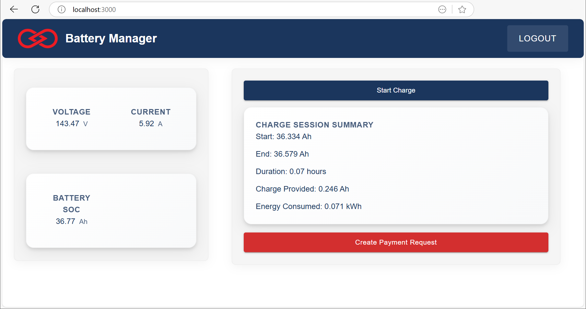

# Profinity API Example - Battery Charging Station

This is an example web application demonstrating how to integrate Profinity APIs with Square's payment processing system to create a battery-powered charging station. The application monitors battery pack usage through Profinity's APIs and processes payments using Square's APIs for the consumed power.

This example uses the PET Profile in Profinity and sample battery data can be shown by running a replay of the Example PET Log.csv .

## Application Overview

The application provides a simple yet complete solution for:

- Real-time monitoring of battery pack status and power consumption
- Secure payment processing through Square
- User-friendly interface for both station operators and customers

## Screenshot



*Screenshot of the battery charging station web application interface*

## Key Features

- **Battery Monitoring**: Real-time tracking of battery pack status, voltage, current, and power consumption
- **Payment Processing**: Seamless integration with Square for secure payment processing
- **Usage Tracking**: Detailed logging of power consumption and associated costs
- **User Management**: Secure authentication and user management system

## Prerequisites

Before you begin, ensure you have the following installed:

- Node.js (v14 or later)
- Yarn (recommended) or npm
- A modern web browser
- Profinity API access credentials and a running Profinity instance
- Square API credentials

## Installation

1. Clone the repository:
```bash
git clone [repository-url]
cd Charge-for-Power-using-Square-Web
```

2. Install dependencies:
```bash
yarn install
```

## Configuration

The application uses environment variables for configuration. You can use either:

1. `.env.production` for production builds
2. `.env.development` for development
3. `.env` for both environments

Required environment variables:
```
REACT_APP_PROFINITY_API_URL=your_profinity_api_url
REACT_APP_SQUARE_ACCESS_TOKEN=your_square_access_token
REACT_APP_SQUARE_LOCATION_ID=your_square_location_id
```

Replace the placeholder values with your actual credentials:
- `your_profinity_api_url`: The URL for your Profinity API instance
- `your_square_access_token`: Your Square API access token
- `your_square_location_id`: Your Square location ID

## Project Structure

```
src/
├── components/      # Reusable UI components
├── services/        # API services (Profinity and Square)
├── hooks/          # Custom React hooks
├── pages/          # Application pages
├── styles/         # Styling and theme configuration
├── types/          # TypeScript type definitions
└── utils/          # Utility functions
```

## Running the Application

The application can be deployed inside Profinity's webserver by copying the files produced during the build see Profinity Hosting `https://docs.prohelion.com/Profinity/Profinity_Version2/Extending_Profinity/` in the Profinity documentation for more information.

### Development Mode

To start the development server:

```bash
yarn start
```

The application will open in your default web browser at `http://localhost:3000`

### Production Build

To create a production build:

```bash
yarn build
```

The build files will be created in the `build` directory.

## Contributing

1. Fork the repository
2. Create your feature branch (`git checkout -b feature/amazing-feature`)
3. Commit your changes (`git commit -m 'Add some amazing feature'`)
4. Push to the branch (`git push origin feature/amazing-feature`)
5. Open a Pull Request

## License

This project is licensed under the MIT License - see the [LICENSE.txt](LICENSE.txt) file for details.

## Support

For support, please contact Prohelion Support via our website at [www.prohelion.com](https://www.prohelion.com) 