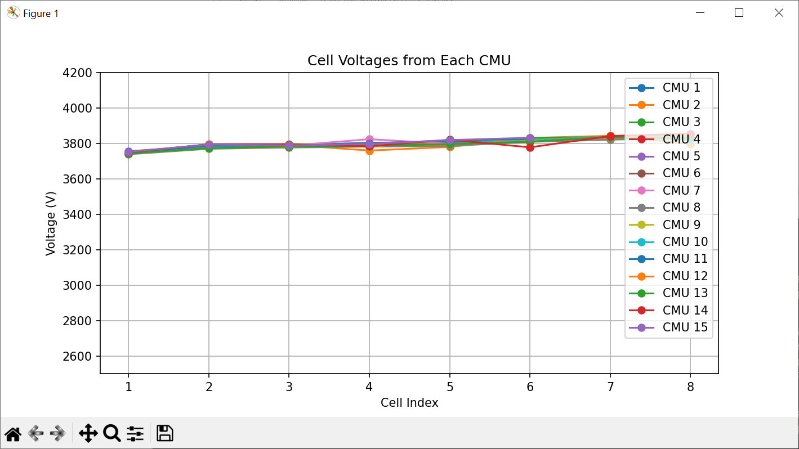

# Python Data Science using Prohelion BMS

This is an example Python application demonstrating how to connect to the Prohelion API, authenticate, and retrieve data from a Prohelion Gen1 1000V BMS. The script fetches the current voltages from each Cell Management Unit (CMU) and displays them on a graph.

## Prerequisites

- Python 3.7 or later
- Internet connection
- Prohelion API credentials (username and password)

## Installation

1. Download or clone this repository:

```bash
git clone [repository-url]
cd "Prohelion Data Science using Prohelion BMS"
```

2. Install dependencies:

```bash
pip install -r requirements.txt
```

## Usage

1. Run the main script:

```bash
python main.py
```

2. When prompted, enter your Prohelion API server URL (or press Enter to use the default), username, and password.
3. The script will authenticate, fetch BMS data, and plot the cell voltages for each CMU.

## Notes

- Ensure you have internet access to connect to the Prohelion API.
- If you encounter SSL or certificate issues, see the Python documentation for web access troubleshooting.

## License

This project is licensed under the MIT License - see the [LICENSE.txt](../LICENSE.txt) file for details.

## Support

For support, please contact Prohelion Support via our website at [www.prohelion.com](https://www.prohelion.com)

**Tip:** To see meaningful data in this example, use the PET Profile and replay the Example PET Log in your Prohelion system. This will populate the API with data that the script can retrieve and plot.

## Example Output

Below is an example of the cell voltage plot generated by this script:

 