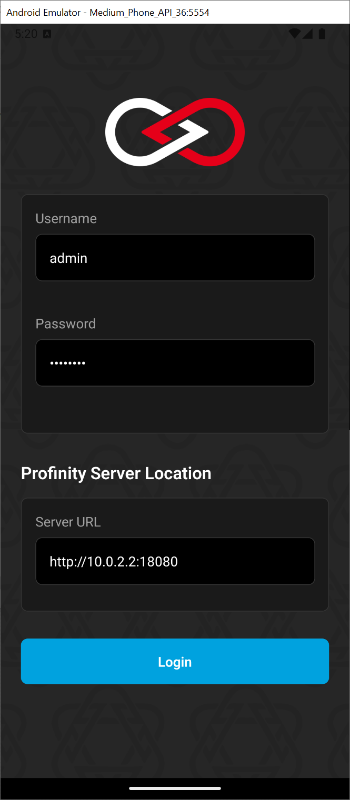
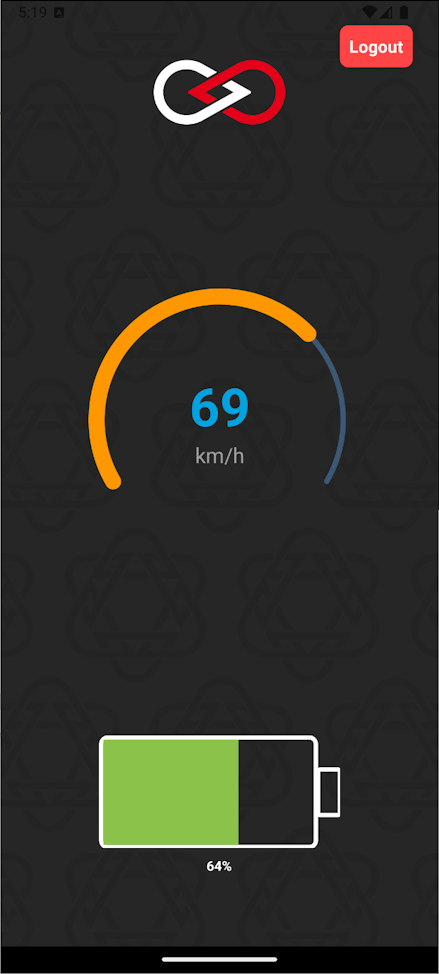

# Profinity API Example Mobile App

This is an example mobile application demonstrating how to connect to and use Profinity APIs. The app is built using React Native with Expo, providing a cross-platform solution that works on both Android and iOS devices.  It uses the Profinity APIs to get access to WaveScultor and BMS information.

To test the application, run the PET Profile in Profinity and use the CAN Log Replayer to replay the PET Log for a set of demo data.

## App Screenshots

<table>
  <tr>
    <td width="50%">
      
      <p align="center"><strong>Login Screen</strong></p>
      <p align="center">Secure authentication interface for accessing the vehicle dashboard</p>
    </td>
    <td width="50%">
      
      <p align="center"><strong>Dashboard Screen</strong></p>
      <p align="center">Real-time vehicle data and status information</p>
    </td>
  </tr>
</table>

## Prerequisites

Before you begin, ensure you have the following installed:
- Node.js (v14 or later)
- Yarn (recommended) or npm
- Expo CLI (`yarn global add expo-cli` or `npm install -g expo-cli`)
- For iOS development: Xcode (Mac only)
- For Android development: Android Studio (see below)
- For web development: A modern web browser

## Setting up Android Development Environment

The Android Development Environment is required to build this software for running on Android devices.

1. Install Android Studio from [developer.android.com](https://developer.android.com/studio)
2. During installation, make sure to install:
   - Android SDK
   - Android SDK Platform
   - Android Virtual Device
3. Set up environment variables:
   - Open System Properties > Advanced > Environment Variables
   - Add new System Variable:
     - Variable name: `ANDROID_HOME`
     - Variable value: `C:\Users\[YourUsername]\AppData\Local\Android\Sdk`
   - Edit Path variable and add:
     - `%ANDROID_HOME%\platform-tools`
4. Verify installation:
   - Open a new terminal/command prompt
   - Run `adb --version` to verify ADB is accessible
   - Run `echo %ANDROID_HOME%` to verify the SDK path

## Installation

1. Clone the repository:

```bash
git clone [repository-url]
cd Example Apps\Vehicle Dashboard (Android & iOS Mobile App)
```

2. Install dependencies:

```bash
yarn install
```

## Project Structure

```
src/
├── assets/          # Static assets (images, fonts, etc.)
├── components/      # Reusable UI components
├── constants/       # Application constants and configuration
├── hooks/           # Custom React hooks
├── screens/         # Screen components
├── services/        # API and other services
├── types/           # TypeScript type definitions
└── utils/           # Utility functions
```

## Running the App

### Development Mode

To start the development server:

```bash
yarn start
```

This will start the Expo development server and provide you with several options:
- Press `w` to run in web browser
- Press `a` to run on Android emulator
- Press `i` to run on iOS simulator (Mac only)
- Scan the QR code with the Expo Go app on your physical device

The app will open in your default web browser at `http://localhost:8081`

### Building for Production

#### Android and iOS

1. Install EAS CLI globally:
```bash
yarn global add eas-cli
```

2. Create an Expo account:
   - Visit [https://expo.dev/signup](https://expo.dev/signup)
   - Sign up using your email or GitHub account
   - Verify your email address
   - Complete your profile setup

3. Log in to your Expo account:
```bash
eas login
```

4. Configure your app in `app.json` and create an `eas.json` file if it doesn't exist

5. Build the app using one of the following profiles:

```bash
# Development build (with debugging enabled)
eas build --profile development

# Preview build (for testing)
eas build --profile preview

# Production build (for app stores)
eas build --profile production
```

The `eas.json` file includes three build profiles:
- **development**: For development builds with debugging enabled
- **preview**: For testing builds (generates APK for Android)
- **production**: For release builds (generates Android App Bundle)

6. Follow the prompts to set up your credentials (keystore for Android, Apple Developer account for iOS)
7. Wait for the build to complete
8. Download the build from the provided URL or use `eas build:list` to view your builds

For more information about EAS Build, visit: https://docs.expo.dev/build/setup/

## Contributing

1. Fork the repository
2. Create your feature branch (`git checkout -b feature/amazing-feature`)
3. Commit your changes (`git commit -m 'Add some amazing feature'`)
4. Push to the branch (`git push origin feature/amazing-feature`)
5. Open a Pull Request

## License

This project is licensed under the MIT License - see the LICENSE file for details.

## Support

For support, please contact Prohelion Support via our website at www.prohelion.com