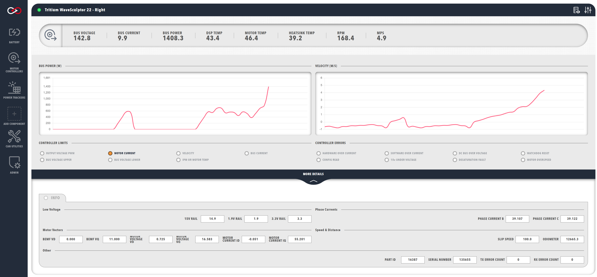

# Profinity V2 Early Adopter Release

This repository is the official release site for the **Prohelion Profinity V2 Early Adopter Release**.

Profinity V2 is Prohelion's comprehensive CAN bus management platform, designed to connect your CAN-based solutions to modern cloud, API, and big data technologies. This Early Adopter Release provides access to the latest features and improvements, including:

- Modern container and API-centric architecture
- Enhanced cloud connectivity
- Improved user interface
- Advanced device management
- Role-based access control and security (V2 only)
- Advanced data logging and integration options

## Download and Install

### Windows

| Installer | Documentation |
| --------- | ------------- |
| [Download Profinity V2 Early Adopter Release Installer](https://github.com/Prohelion/Profinity_V2_Early_Adopter_Release/releases/latest/download/Profinity.Install.msi) | [Windows Installation Documentation](https://docs.prohelion.com/Profinity/Profinity_Version2/Installation/Windows_Installation.html) |

### Native Unix / macOS:

| Installer | Documentation |
| --------- | ------------- |
| [Download Profinity V2 Early Adopter Release Zip](https://github.com/Prohelion/Profinity_V2_Early_Adopter_Release/releases/latest/download/Profinity.zip) | [Native macOS Installation Documentation](https://docs.prohelion.com/Profinity/Profinity_Version2/Installation/Zip_Installation.html) |

### Docker

| Documentation |
| ------------- |
| [Docker Installation Documentation](https://docs.prohelion.com/Profinity/Profinity_Version2/Installation/Docker_Installation.html) |

## Example Profinity Extensions

A set of example applications is included to help you get started with Profinity V2. These cover web, mobile, and data science use cases, demonstrating how to integrate with the Profinity API for real-time monitoring, data analysis, and custom solutions. 

Example apps include a battery charging station web app, a cross-platform vehicle dashboard mobile app, and data science scripts for Matlab and Python.

There is also a range of example scripts provided to get you started with Profinity scripting.

## Documentation

Full documentation for Profinity V2 is available at:
[https://docs.prohelion.com/Profinity/Profinity_Version2/index.html](https://docs.prohelion.com/Profinity/Profinity_Version2/index.html)

## Accessing the Early Adopter Release

To get access to the Profinity V2 installers, please log a support request at the [Prohelion Support Portal](https://support.prohelion.com/) requesting access to the Early Adopter release.

## Support

- Visit our [Support Portal](https://support.prohelion.com/)
- [Contact Us](https://prohelion.com/contact/)
- Check our [FAQs](https://docs.prohelion.com/FAQs/index.html)

---

© 2016 - 2025 Prohelion Pty Ltd
